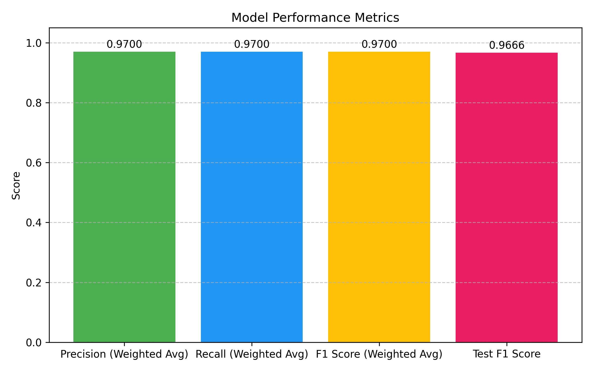
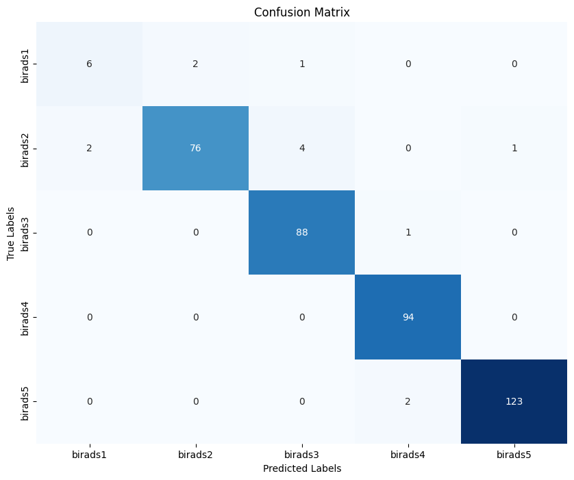

# Mamografi Metin Analizi ile BI-RADS Sınıflandırması

## 📌 Özellikler
- **Türkçeye Özel Ön İşleme**: Tıbbi metinler için özel veri temizleme ve normalleştirme..
- **Birçok Model Test Edildi**: En iyi doğruluk oranına sahip model seçildi.
- **Çok Sınıflı BI-RADS Sınıflandırması**: BI-RADS 0-5 arası kategorileri sınıflandırır.

## 🛠️ Installation
```bash
git clone Mamografi-Metin-Analizi-ile-BI-RADS-Sınıflandırması.git
cd Mamografi-Metin-Analizi-ile-BI-RADS-Sınıflandırması
```


## 📊 Sonuçlar - Bi Rads Sınıflandırma
- **Metrics Bar Chart**: Bar chart comparing key performance metrics (Precision, recall, F1, test F1 score)



- **Confusion Matrix**: Visual representation of the model's true positives, false positives, true negatives, and false negatives



## License

[MIT License](LICENSE)
